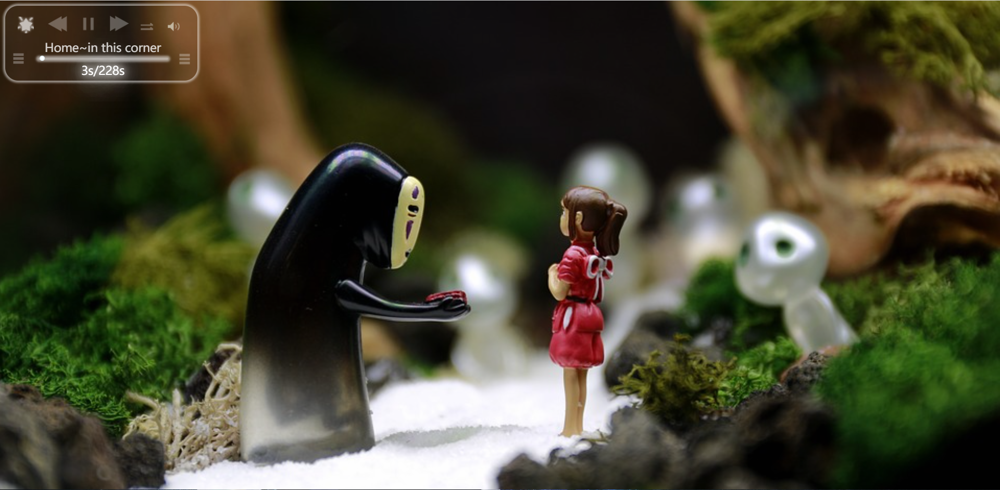
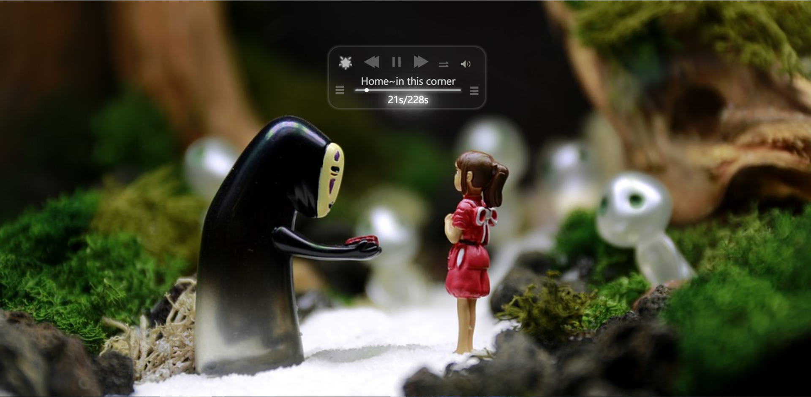
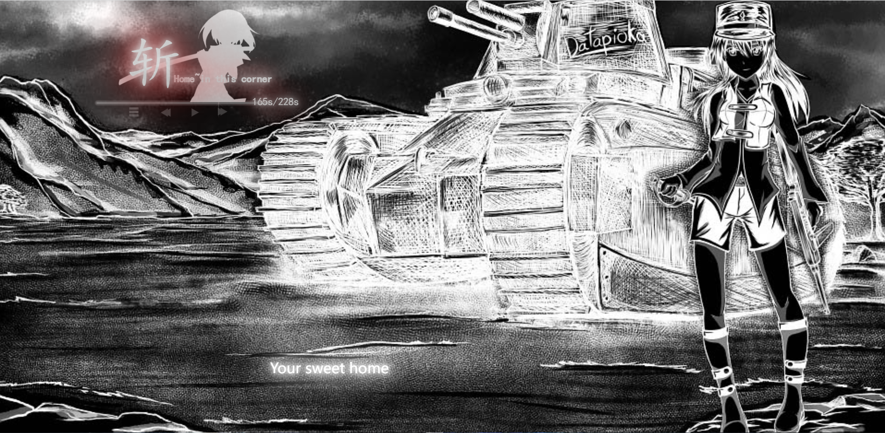

# 可变换背景的播放器插件

大三时写的浏览器播放器插件(~远古老物~)，变换背景时开销比较大......

功能：

1. 播放歌曲（废话）
2. 播放器可拖动
3. 可以动态改变背景
4. 可以显示歌词

## 效果截图

注：以下使用的背景图免费而且均来在https://pixabay.com/，遵循Pixabay License，在此感谢无私奉献的艺术家。

播放歌曲



可拖动



背景切换-播放器皮肤切换



## 使用说明

创建一个musiclist.js文件，配置歌曲信息，当然为了方便测试我把文件都放在本地，你需要放在服务器上

```javascript
var musiclist = new Array();
var picturelist = new Array();

musiclist[0] = {
    title: 'PSYCHO-PASS',
    singer: 'EGOIST',
    src: 'music/EGOIST - Fallen - 心理测量者 第二季 片尾曲  PSYCHO-PASS サイコパス 2 ED.mp3',
    lyric: 'Lyric/FallOutBoy.txt',
}
picturelist[0] = {
    picture1: 'musicbg/MU2-1.jpg',
    picture2: 'musicbg/MU2-2.jpg',
    picture3: 'musicbg/MU2-3.jpg',
}

musiclist[1] = {
    title: 'Release My Soul',
    singer: 'Aimee Blackschleger',
    src: 'music/Aimee Blackschleger - Release My Soul.mp3',
    lyric: 'Lyric/ReleaseMySoul.txt',
}

picturelist[1] = {
    picture1: 'musicbg/MU1-1.jpg',
    picture2: 'musicbg/MU1-2.jpg',
    picture3: 'musicbg/MU1-3.png',
}

musiclist[2] = {
    title: 'Home~in this corner',
    singer: 'Leina',
    src: 'music/Leina - Home~in this corner~.mp3',
    lyric: 'Lyric/LeinaHome~inthiscorner.txt',
}
picturelist[2] = {
    picture1: 'musicbg/MU2-1.jpg',
    picture2: 'musicbg/MU2-2.jpg',
    picture3: 'musicbg/MU2-3.jpg',
}
```

歌词格式为.lrc(需要把.lrc改成.txt)

需要放置播放器的页面上添加以下代码

```javascript
<script src="js/mymusic.js" ></script>
<script src="js/musiclist.js" ></script>
<script>
new Aplayer({
    musiclist :musiclist,
    picturelist:picturelist,
});
</script>
```

接下来就可以打开浏览器查看效果了


